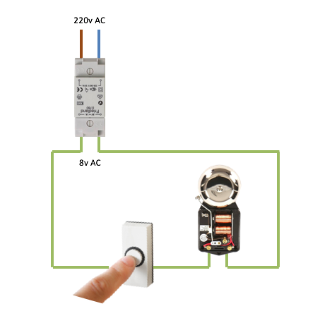
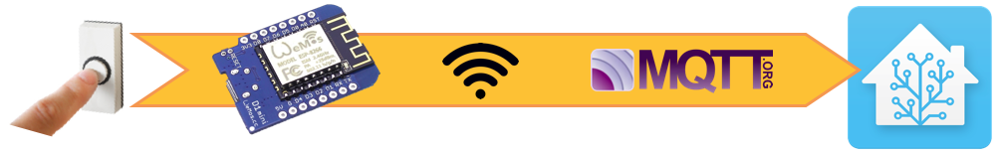
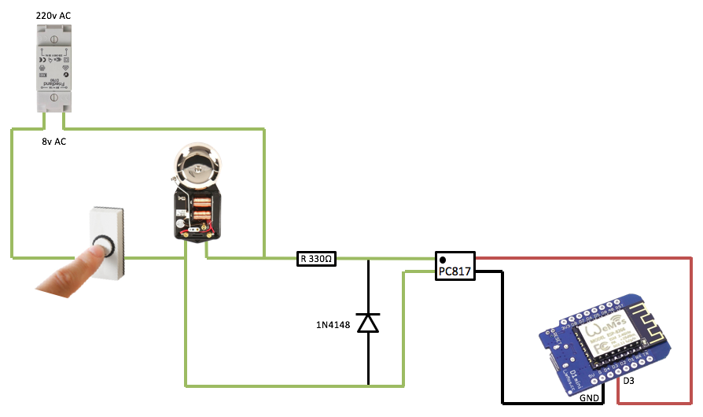
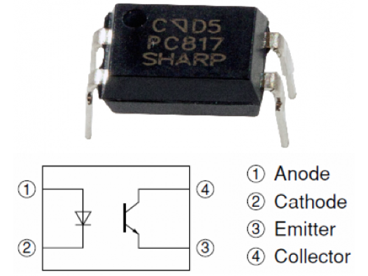

# Doorbell via Wemos and optocoupler

This is the new version of my [initial doorbell project](https://github.com/tIsGoud/Doorbell-via-Wemos/).   
The main goal is to determine if the doorbell was pressed and perform some actions based on it.

I could have made a version 2.0 of the initial setup but that did not feel right. The hardware and the software are very different.

The setup for this version was inspired by an article in the German c't magazine (2017/17).
In the German magazine an optocoupler is used to separate the doorbell from a Raspberry Pi.

In version 1 I used the analog port(A0) on the Wemos to read out the voltage, this version receives a signal from the optocoupler that is read on a digital port.
A nice galvanic separation between the two circuits, thereby protecting the Wemos.

As in the previous version the main requirements is that I do not want to mess with the existing doorbell installation or have a dependency on extra components.

The standard Dutch doorbell installation:



Once the doorbell-button is pressed, the "signal" is send to the Wemos. The Wemos is connected to MQTT via the local Wi-Fi.
Home Assistant picks up the signal from MQTT. From there it's up to your imagination what you want to do with the input.
For now I send a message to a Slack-bot to notify me.



## Hardware v2.0

For the initial setup we need the following parts:
- Resistor, 330Ω
- Diode, 1N4148
- Optocoupler, PC817

The resistor lowers the voltage, the diode "flattens" the signal and the optocoupler sends the signal to the Wemos on port(D3/GPIO0).



The value read on port D3 is by default 1, pressing the doorbell drops the signal to 0. Not what I initially expected but this is how it works.

Another learning point was how to connect the optocoupler. On the surface there is a "dot", this indicates port 1, the anode that connects to the doorbell. The emitter and collector are connected to the Wemos.



On the breadbord the setup is nice and simple.


## Software v2.0

On the Wemos I use [Homie for ESP8266](https://github.com/marvinroger/homie-esp8266) to:
- Connect and stay connected to the Wi-Fi
- Connect and stay connected to MQTT
- Send data to MQTT

The [Wemos D1 mini BasicIO example](https://github.com/wemos/D1_mini_Examples/tree/master/examples/01.Basics/BasicIO) shows how to read the input pin (D3).
In the example the input pin is set to INPUT, this could lead to a "floating" signal. To prevent that we set it to INPUT_PULLUP.

Pressing the doorbell button lights up the Wemos onboard led. A nice visual feedback, convenient during development.

The input pin D3 is read in a loop with a delay defined in the variable "readDelay". Otherwise it would be polling constantly. The readDelay with a value of 50 works fine, with higher values and pressing the button multiple times or constantly somehow destabilizes the system. Annoying, although only temporary.

To prevent multiple triggers when the button is either pressed very long or multiple times I use the "buttonPressDelay" variable. Setting "buttonPressDelay" to a value of 3 to 5 seconds works fine and results in just one trigger.

The readDelay and buttonPressDelay values are set in milliseconds.

## Home Assistant configuration

I use [Home Assistant](https://home-assistant.io/) for home automation.
Below are the parts of the Home Assistent configuration that handle the MQTT message and send me a notification via Slack:

```
automation:
- alias: "Doorbell pressed"
  hide_entity: True
  trigger:
    platform: mqtt
    topic: wemos/doorbell/button/pressed
    payload: 'true'
  action:
    service: notify.Slack
    data:
      message: "Someone at the door!"
      title: "Doorbell says ..."
 ```

 ```
 notify:
  - name: Slack
    platform: slack
    api_key: !secret Slack_API-key
    username: !secret Slack_Username
    default_channel: '#hass'
    icon: ':house:'
```      
